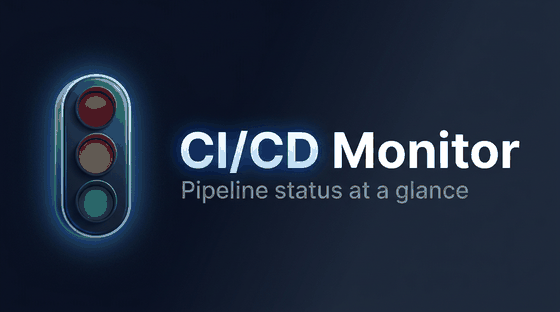

# CI/CD Monitor

<p align="center">
  
</p>

*One panel for CI + tests + services.*

A practical Python tool for DevOps and QA engineers that collects CI/CD pipeline statuses, parses test reports, generates reports, and optionally sends Telegram alerts and monitors Docker services.

---

## Documentation

- **Users (install/run/configure/use UI)**: `docs/USER_GUIDE.md`
- **Developers (architecture/extension points)**: `docs/DEVELOPER_GUIDE.md`
- **Workflow (Issues/PRs)**: `docs/WORKFLOW.md`

## Project links

- **Source repository**: `https://github.com/Craxti/pipeline-monitor`

## License

MIT License (2026). See `LICENSE`.

---


## Layout (high level)

```text
cicd_mon/
├── clients/           # Jenkins / GitLab API clients
├── parsers/           # JUnit, Allure, console parsers
├── docker_monitor/    # Container + HTTP checks
├── models/            # Shared domain models (snapshot, tests, …)
├── notifications/   # Telegram
├── reports/           # Rich / CSV / HTML reports
├── web/
│   ├── app.py         # FastAPI app, middleware, most HTTP handlers
│   ├── db.py          # Optional SQLite persistence
│   ├── schemas.py     # Pydantic: health, readiness, general, incident bundle
│   ├── routes/
│   │   ├── ops.py           # GET /health, /ready
│   │   ├── incident.py      # /api/incident*, /api/export/incident*
│   │   ├── collect.py       # (stub) collect — handlers still in app.py
│   │   ├── builds.py        # (stub) builds
│   │   ├── tests.py         # (stub) tests / failures
│   │   ├── services.py      # (stub) services
│   │   ├── settings.py      # (stub) settings
│   │   └── chat.py          # (stub) chat
│   ├── services/
│   │   ├── incident_bundle.py
│   │   ├── aggregation.py   # (stub)
│   │   └── exports.py       # (stub)
│   ├── static/
│   │   ├── app.css          # entry: @import dashboard.css
│   │   ├── app.js           # thin entry; logic in dashboard.js
│   │   ├── dashboard.js
│   │   └── dashboard.css
│   └── templates/     # Jinja2 (index, settings, partials)
├── tools/             # Small maintenance scripts
├── ci_monitor.py      # CLI entrypoint
└── config.yaml        # Instance configuration
```

---

## Features

| Module | Description |
|---|---|
| `clients/` | Jenkins & GitLab REST API adapters |
| `parsers/` | pytest JUnit XML + Allure JSON parsers |
| `reports/` | Console (Rich), CSV, HTML (Jinja2) |
| `notifications/` | Telegram alerts for critical job failures |
| `docker_monitor/` | Docker container state + HTTP health checks |
| `web/` | FastAPI REST API + live dashboard |

---

## Quick Start

### 1. Install dependencies

```bash
py -m pip install -r requirements.txt
```

### 2. Configure

Edit `config.yaml` — at minimum enable the systems you use.
The current config supports **multiple Jenkins and GitLab instances**.

```yaml
jenkins_instances:
  - name: "Jenkins"
    enabled: true
    url: "http://your-jenkins:8080"
    username: "admin"
    token: "your-api-token"
    jobs:
      - name: "backend-build"
        critical: true
        parse_console: true
    max_builds: 10
    show_all_jobs: false
    verify_ssl: true

gitlab_instances:
  - name: "GitLab"
    enabled: true
    url: "https://gitlab.example.com"
    token: "glpat-xxxxxxxxxxxx"
    projects:
      - id: "mygroup/myrepo"
        critical: true
    max_pipelines: 10
    show_all_projects: false

docker_monitor:
  enabled: false

web:
  host: "0.0.0.0"
  port: 8000
```

### 3. Collect data and generate reports

```bash
# Collect last 7 days, print to console
py ci_monitor.py collect

# Collect and output all formats (console + CSV + HTML)
py ci_monitor.py collect --format all

# Collect from yesterday only
py ci_monitor.py collect --from yesterday --format html

# Short one-line summary
py ci_monitor.py collect --format console --short

# Parse only local test logs (no CI connection needed)
py ci_monitor.py collect --format all
```

### 4. Re-generate reports from last snapshot

```bash
py ci_monitor.py report --format html
py ci_monitor.py report --format csv
```

### 5. Start the web dashboard

```bash
py ci_monitor.py web
# open http://127.0.0.1:8000 (or whatever web.host/web.port are)
```

If the page never finishes loading while `web.live_reload` is `true`, set it to `false` in `config.yaml`. Uvicorn’s `--reload` restarts the worker when files under `web/` change; rapid restarts (IDE, formatters) can interrupt the browser. Reload mode watches only the `web/` tree, not the whole repo.

The dashboard shows:
- Builds / pipelines (Jenkins & GitLab)
- Tests (from CI console / Allure, plus local parsers)
- Services (Docker + HTTP checks)
- Trends, incident center, and collect logs

#### Protecting sensitive endpoints (shared token)

You can require a shared token (header) for dangerous endpoints: saving settings, manual collect, action triggers, webhook ingest, log viewers, and AI chat.

- **Header**: `X-API-Token: <token>`
- **Alternative**: `Authorization: Bearer <token>`

Configure either:

- **Environment variable**: `CICD_MON_API_TOKEN`
- **config.yaml**: `web.api_token: "<token>"`

If no token is configured, auth is **disabled** for backward compatibility.

#### Local AI (Ollama)

If you run Ollama locally, you can point the dashboard AI provider to an OpenAI-compatible endpoint:

- **base URL**: `http://127.0.0.1:11434/v1`
- **model**: `llama3.1:8b`

### 6. Check Docker / HTTP services

```bash
# Enable in config.yaml first
py ci_monitor.py docker-check
```

### 7. Send Telegram notifications

```bash
# Enable in config.yaml, then:
py ci_monitor.py collect --notify
# or standalone:
py ci_monitor.py notify
```

---

## CLI Reference

```
py ci_monitor.py [--config CONFIG] [--log-level LEVEL] COMMAND [OPTIONS]

Commands:
  collect       Collect CI/CD data and generate reports
  report        Re-generate reports from last snapshot
  web           Start FastAPI dashboard
  docker-check  Run Docker/HTTP health checks
  notify        Send notifications from last snapshot

collect options:
  --from TEXT   Lookback window: yesterday | today | week | month | Nd | YYYY-MM-DD | all
  --format      console | csv | html | all
  --short       One-line summary instead of full table
  --notify      Send notifications after collecting
```

---

## Configuration Reference (`config.yaml`)

```yaml
general:
  project_name: "CI/CD Monitor"
  default_lookback_days: 7
  data_dir: "data"
  log_level: "INFO"

jenkins_instances:
  - name: "Jenkins"
    enabled: false
    url: "http://jenkins.example.com"
    username: ""
    token: ""
    jobs:
      - name: "backend-build"
        critical: true        # alerts + incident signals
        parse_console: true   # parse tests from console (if enabled)
    max_builds: 10
    show_all_jobs: false      # if true, pulls job list from Jenkins and uses limits below
    show_all_limit_jobs: 25
    parse_console: false
    console_jobs_limit: 25
    console_builds: 5
    parse_allure: false
    allure_jobs_limit: 25
    allure_builds: 5
    verify_ssl: true

gitlab_instances:
  - name: "GitLab"
    enabled: false
    url: "https://gitlab.example.com"
    token: ""
    projects:
      - id: "mygroup/myrepo"
        critical: true
    max_pipelines: 10
    show_all_projects: false

parsers:
  pytest_xml_dirs:
    - "sample_logs"        # scanned recursively for *.xml
  allure_json_dirs:
    - "sample_logs"        # scanned for *-result.json
  top_failures: 5

reports:
  output_dir: "data"
  csv_filename: "ci_report.csv"
  html_filename: "ci_report.html"
  console_mode: "detailed" # or "short"

notifications:
  telegram:
    enabled: false
    # New format: multiple bots (preferred)
    bots:
      - enabled: true
        bot_token: ""
        chat_id: ""
        critical_only: true
        api_base_url: ""    # optional self-hosted Bot API base (SSRF-guarded)
    # Legacy flat format is still supported:
    # bot_token: ""
    # chat_id: ""
    # critical_only: true

docker_monitor:
  enabled: false
  show_all_containers: true
  containers: []           # empty = watch all running containers
  http_checks:
    - name: "api"
      url: "http://localhost:8000/health"
  timeout_seconds: 5

web:
  host: "0.0.0.0"
  port: 8000
  live_reload: true
  auto_collect: false
  collect_interval_seconds: 300
  api_token: ""            # optional shared token (see above)

# AI / LLM settings used by the dashboard chat endpoint.
# Despite the key name, this block supports multiple providers (incl. Ollama).
openai:
  provider: "ollama"        # ollama | openai | gemini | openrouter | cursor | ...
  api_key: ""               # often empty for local ollama
  model: "llama3.1:8b"
  base_url: "http://127.0.0.1:11434/v1"
```

---

## Webhook Integration

The web server exposes a webhook endpoint so CI systems can push events directly:

```bash
# Start the web server
py ci_monitor.py web

# Trigger from Jenkins post-build step / GitLab CI job
curl -X POST http://127.0.0.1:8000/webhook/build-complete \
  -H "Content-Type: application/json" \
  -d '{"source":"jenkins","job":"backend-build","status":"failure","build_number":143,"critical":true}'
```

Note: the webhook is protected by the shared token if `CICD_MON_API_TOKEN` / `web.api_token` is set.

---

## Cron / Scheduled Runs

**Linux/macOS** (`crontab -e`):
```cron
# Every hour: collect data and send notifications
0 * * * * cd /path/to/cicd_mon && /usr/bin/python3 ci_monitor.py collect --format all --notify
```

**Windows Task Scheduler** (or `.bat`):
```bat
cd /d D:\prooftech\cicd_mon
py ci_monitor.py collect --format all --notify
```

---

## Project Structure

```
cicd_mon/
├── ci_monitor.py          # Main CLI entry point
├── config.yaml            # Configuration
├── seed_demo.py           # Seed demo data (offline testing)
├── requirements.txt
│
├── models/
│   └── models.py          # Pydantic: BuildRecord, TestRecord, CISnapshot...
│
├── clients/
│   ├── base.py            # Abstract HTTP client with retry
│   ├── jenkins_client.py  # Jenkins REST API adapter
│   └── gitlab_client.py   # GitLab Pipelines API adapter
│
├── parsers/
│   ├── base.py            # Abstract parser
│   ├── pytest_parser.py   # JUnit XML (pytest --junitxml)
│   └── allure_parser.py   # Allure *-result.json files
│
├── reports/
│   ├── csv_report.py      # CSV export
│   ├── html_report.py     # Jinja2 HTML report
│   └── console_report.py  # Rich terminal output
│
├── notifications/
│   └── telegram_notifier.py
│
├── docker_monitor/
│   └── monitor.py         # Docker SDK + HTTP health checks
│
├── web/
│   ├── app.py             # FastAPI app + REST endpoints
│   └── templates/
│       └── index.html     # Live dashboard
│
├── sample_logs/
│   ├── sample_pytest.xml
│   └── sample-allure-result.json
│
└── data/                  # Generated: snapshot.json, ci_report.csv, ci_report.html
```

---

## Adding New CI Systems

1. Create `clients/bitbucket_client.py` inheriting from `BaseCIClient`
2. Implement `fetch_builds()` returning `list[BuildRecord]`
3. Import and call it in `ci_monitor.py` inside the `collect` command

## Adding New Report Parsers

1. Create `parsers/testng_parser.py` inheriting from `BaseParser`
2. Set `glob_pattern` and implement `parse_file()` returning `list[TestRecord]`
3. Add its directory config to `config.yaml` under `parsers:`

---

## REST API Endpoints

| Method | Path | Description |
|---|---|---|
| `GET` | `/` | Live web dashboard |
| `GET` | `/health` | Health check |
| `GET` | `/api/status` | Full snapshot JSON |
| `GET` | `/api/builds` | Build records list |
| `GET` | `/api/tests` | Test records list |
| `GET` | `/api/tests/top-failures?n=10` | Top N failing tests |
| `GET` | `/api/services` | Service health list |
| `GET` | `/api/trends` | Trends time series |
| `GET` | `/api/incident.json` | Incident export (JSON) |
| `GET` | `/api/incident.md` | Incident export (Markdown) |
| `GET` | `/api/collect/status` | Background collect state |
| `GET` | `/api/collect/logs` | Live collect logs for UI |
| `GET` | `/api/collect/slow` | Top slow operations during collect |
| `POST` | `/api/collect` | Trigger manual collect (token-protected if enabled) |
| `POST` | `/webhook/build-complete` | Receive build events (token-protected if enabled) |

---

## Demo (no CI connection needed)

```bash
# Seed with realistic fake builds
py seed_demo.py

# Parse sample test logs + show full report
py ci_monitor.py collect --format all

# Start dashboard
py ci_monitor.py web
# open http://127.0.0.1:8000
```
