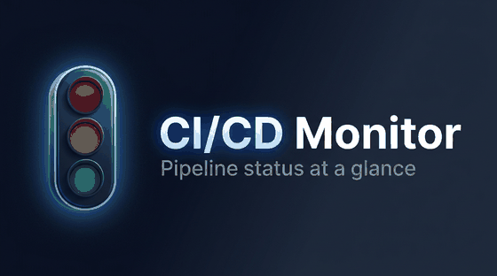

# CI/CD Monitor

<p align="center">
  
</p>

*One panel for CI + tests + services.*

A practical Python tool for DevOps and QA engineers that collects CI/CD pipeline statuses, parses test reports, generates reports, and optionally sends Telegram alerts and monitors Docker services.

---

## Documentation

- **Users (install/run/configure/use UI)**: `docs/USER_GUIDE.md`
- **Developers (architecture/extension points)**: `docs/DEVELOPER_GUIDE.md`
- **Workflow (Issues/PRs)**: `docs/WORKFLOW.md`
- **Dashboard filters (URL → API)**: `docs/HOW_FILTERS_WORK_END_TO_END.md`
- **Trends KPI semantics**: `docs/KPI_FAQ.md`
- **Operational runbook**: `docs/RUNBOOK_INCIDENTS.md`
- **Quality gates ADR**: `docs/adr/0001-quality-gates-and-mock-first-testing.md`

## Project links

- **Source repository**: `https://github.com/Craxti/pipeline-monitor`

## License

MIT License (2026). See `LICENSE`.

---


## Layout (high level)

```text
./
├── clients/            # Jenkins / GitLab / GitHub API clients
├── parsers/            # JUnit, Allure, Jenkins console/Allure parsers
├── service_monitors/   # Zabbix, Prometheus, Alertmanager, DB probes, …
├── docker_monitor/     # Local/remote Docker + HTTP checks
├── models/             # Shared domain models (snapshot, tests, services, …)
├── notifications/      # Telegram notifications
├── reports/            # Rich / CSV / HTML reports
├── tests/              # Unit/integration/contract tests
├── web/
│   ├── app.py          # FastAPI app (thin wrapper → app_composer)
│   ├── db.py           # SQLite: settings, snapshot, history, incidents
│   ├── core/           # auth, config, runtime, snapshot/trends, notifications
│   ├── routes/         # HTTP routers (dashboard, collect, settings, chat, …)
│   ├── services/       # Endpoints, collect_sync, log intelligence, exports
│   ├── static/         # Dashboard JS/CSS/assets
│   └── templates/      # Jinja2 pages/partials (dashboard, settings)
├── ci_monitor.py       # CLI entrypoint
├── config.example.yaml # Seed defaults (imported into DB on first start)
├── compose.yml         # Docker Compose (port 8020)
├── pyproject.toml      # Tooling config (ruff/pytest/etc.)
├── requirements.txt    # Runtime dependencies
└── data/               # Runtime (monitor.db, reports, …)
```

---

## Features

| Module | Description |
|---|---|
| `clients/` | Jenkins, GitLab, and GitHub REST API adapters |
| `parsers/` | pytest JUnit XML, Allure JSON, Jenkins console/Allure parsers |
| `service_monitors/` | External monitoring: Zabbix, Prometheus, Alertmanager, Uptime Kuma, Netdata, PRTG, Checkmk, HTTP JSON, Postgres/Redis/MongoDB/MySQL/Elasticsearch/Kafka |
| `reports/` | Console (Rich), CSV, HTML (Jinja2) |
| `notifications/` | Telegram alerts for critical job failures |
| `docker_monitor/` | Local/remote Docker containers + HTTP health checks |
| `web/` | FastAPI REST API, SSE live updates, dashboard UI, log intelligence, service incidents |

---

## Quick Start

### Run with Docker (recommended)

**Requirements:** [Docker](https://docs.docker.com/get-docker/) with Compose v2 (Docker Desktop includes it).

The repository includes a `Dockerfile` and a `compose.yml` for a **one-command start**.
No local Python is required. The app stores **all settings in SQLite** (`data/monitor.db` key `app_config_json`); on first start it seeds from `config.example.yaml` if the DB is empty. Edit later via **Settings** in the UI.

**From a fresh clone**

```bash
git clone https://github.com/Craxti/pipeline-monitor.git
cd pipeline-monitor
docker compose up -d --build
# Dashboard: http://127.0.0.1:8020/health
```

**Already in the repo folder**

```bash
# 1) Build and start in background
docker compose up -d --build

# 2) Open the dashboard
# http://127.0.0.1:8020

# 3) See logs (optional)
docker compose logs -f

# 4) Stop
docker compose down
```

**Prebuilt image (when published to GHCR; tag may be `main` or `latest`)**

```bash
docker pull ghcr.io/craxti/pipeline-monitor:latest
docker run --rm -d --name pipeline-monitor-web -p 8020:8020 \
  -e CICD_MON_DATA_DIR=/app/data \
  -v /var/run/docker.sock:/var/run/docker.sock \
  -v pipeline-monitor-data:/app/data \
  ghcr.io/craxti/pipeline-monitor:latest
```

If the first pull 404s, the image is not published yet: use `docker compose up -d --build` from a clone, or your fork’s `ghcr.io/<fork-owner>/<repo>:<tag>`. After you push, open the latest **Actions** run for the **Docker publish** workflow and confirm the **Build and push** step is green; if it failed, the image is not in GHCR yet. A successful push appears under **GitHub → Packages** for the repo (not under **Code** in the file tree). Private images require `docker login ghcr.io` before `docker pull`.

Notes:
- **Config + history DB**: stored in Docker volume `pipeline-monitor-data` as `/app/data/monitor.db` (settings + `meta` + historical tables).
- **Docker monitoring from the container** (optional): mount `/var/run/docker.sock` as in the `docker run` example and `compose.yml`.
- **Port**: `8020:8020` (change the host side in `compose.yml` if needed, e.g. `9080:8020`).
- **API token (optional)**: set `CICD_MON_API_TOKEN` in `compose.yml` or `web.api_token` in **Settings** (saved in the DB).

### Run with Docker (without compose)

```bash
docker build -t pipeline-monitor-web:local .
```

**Linux / macOS (named volumes, same as Compose)**

```bash
docker run --rm -d --name pipeline-monitor-web -p 8020:8020 \
  -e CICD_MON_DATA_DIR=/app/data \
  -e PYTHONUNBUFFERED=1 \
  -v /var/run/docker.sock:/var/run/docker.sock \
  -v pipeline-monitor-data:/app/data \
  --restart unless-stopped \
  pipeline-monitor-web:local
```

**PowerShell**

```powershell
docker run -d --name pipeline-monitor-web -p 8020:8020 `
  -e CICD_MON_DATA_DIR=/app/data `
  -e PYTHONUNBUFFERED=1 `
  -v /var/run/docker.sock:/var/run/docker.sock `
  -v pipeline-monitor-data:/app/data `
  --restart unless-stopped `
  pipeline-monitor-web:local
```

Settings and history live in `monitor.db` on the `pipeline-monitor-data` volume; use **Settings** in the UI or a DB backup to change configuration.

**Migrating an old `config.yaml` into the DB:** on first start with an empty `monitor.db`, the app will import a file at `/app/config.yaml` if you mount it (read-only is fine), e.g. `-v /path/to/config.yaml:/app/config.yaml:ro` for one run, then remove the mount.

### 1. Install dependencies

```bash
py -m pip install -r requirements.txt
```

### 2. Configure

Use **Settings** in the web UI (or seed/migrate: optional local `config.yaml` is read once to populate the DB on first start if the DB is empty; primary store is `data/monitor.db`). At minimum, enable the systems you use in Settings.
The current config supports **multiple Jenkins, GitLab, and GitHub instances**, plus **external service monitors** (Zabbix, Prometheus, …).

```yaml
jenkins_instances:
  - name: "Jenkins"
    enabled: true
    url: "http://your-jenkins:8080"
    username: "admin"
    token: "your-api-token"
    jobs:
      - name: "backend-build"
        critical: true
        parse_console: true
    max_builds: 10
    show_all_jobs: false
    verify_ssl: true

gitlab_instances:
  - name: "GitLab"
    enabled: true
    url: "https://gitlab.example.com"
    token: "glpat-xxxxxxxxxxxx"
    projects:
      - id: "mygroup/myrepo"
        critical: true
    max_pipelines: 10
    show_all_projects: false

github_instances:
  - name: "GitHub"
    enabled: false
    url: "https://github.com"
    token: ""
    repos: []
    max_runs: 10
    show_all_repos: false

service_monitors:
  enabled: false
  timeout_seconds: 15
  instances:
    - type: prometheus
      name: prod-prometheus
      enabled: false
      url: http://prometheus:9090

docker_monitor:
  enabled: false

web:
  host: "0.0.0.0"
  port: 8020
```

### 3. Collect data and generate reports

```bash
# Collect last 7 days, print to console
py ci_monitor.py collect

# Collect and output all formats (console + CSV + HTML)
py ci_monitor.py collect --format all

# Collect from yesterday only
py ci_monitor.py collect --from yesterday --format html

# Short one-line summary
py ci_monitor.py collect --format console --short

# Parse only local test logs (no CI connection needed)
py ci_monitor.py collect --format all
```

### 4. Re-generate reports from last snapshot

```bash
py ci_monitor.py report --format html
py ci_monitor.py report --format csv
```

### 5. Start the web dashboard

```bash
py ci_monitor.py web
# open http://127.0.0.1:8020 (or whatever web.host/web.port are)
```

If the page never finishes loading while `web.live_reload` is `true`, set it to `false` in **Settings** (saved in `data/monitor.db`). Uvicorn’s `--reload` restarts the worker when files under `web/` change; rapid restarts (IDE, formatters) can interrupt the browser. Reload mode watches only the `web/` tree, not the whole repo.

The dashboard shows:
- **Overview** — summary cards, favorites, recent activity
- **Builds / pipelines** (Jenkins, GitLab, GitHub)
- **Tests** — runs, failures, Jenkins Allure drill-down
- **Services** — Docker, HTTP checks, external monitors (Zabbix, Prometheus, …)
- **System** — host metrics (CPU/RAM/disk when procfs is available)
- **Trends / uptime** — historical charts and KPI cards
- **Incidents** — service incidents from log intelligence
- **Log intelligence** — container log anomaly detection and correlation
- **HAR analyzer** — upload and inspect network traces
- **Collect panel** — background collect state, logs, manual trigger

#### Protecting sensitive endpoints (shared token)

You can require a shared token (header) for dangerous endpoints: saving settings, manual collect, action triggers, webhook ingest, log viewers, and AI chat.

- **Header**: `X-API-Token: <token>`
- **Alternative**: `Authorization: Bearer <token>`

Configure either:

- **Environment variable**: `CICD_MON_API_TOKEN`
- **Settings / DB**: `web.api_token: "<token>"` in the app config (stored in `data/monitor.db`)

If no token is configured, auth is **disabled** for backward compatibility.

#### Local AI (Ollama)

If you run Ollama locally, you can point the dashboard AI provider to an OpenAI-compatible endpoint:

- **base URL**: `http://127.0.0.1:11434/v1`
- **model**: `llama3.1:8b`

### 6. Check Docker / HTTP services

```bash
# Enable docker_monitor in Settings first
py ci_monitor.py docker-check
```

### 7. Send Telegram notifications

```bash
# Enable notifications in Settings, then:
py ci_monitor.py collect --notify
# or standalone:
py ci_monitor.py notify
```

---

## CLI Reference

```
py ci_monitor.py [--config FILE.yaml] [--log-level LEVEL] COMMAND [OPTIONS]

Omit `--config` to use the same settings as the web app (stored in `data/monitor.db`).

Commands:
  collect       Collect CI/CD data and generate reports
  report        Re-generate reports from last snapshot
  web           Start FastAPI dashboard
  docker-check  Run Docker/HTTP health checks
  notify        Send notifications from last snapshot

collect options:
  --from TEXT   Lookback window: yesterday | today | week | month | Nd | YYYY-MM-DD | all
  --format      console | csv | html | all
  --short       One-line summary instead of full table
  --notify      Send notifications after collecting
```

---

## Configuration Reference (Settings / `monitor.db`; shape matches YAML)

```yaml
general:
  project_name: "CI/CD Monitor"
  default_lookback_days: 7
  incremental_collect: true          # reuse SQLite watermarks (web collect)
  parallel_collect_sources: true     # Jenkins/GitLab/GitHub/Docker/monitors in parallel
  parallel_collect_instances: true
  parallel_collect_instance_workers: 6
  data_dir: "data"
  log_level: "INFO"

jenkins_instances:
  - name: "Jenkins"
    enabled: false
    url: "http://jenkins.example.com"
    username: ""
    token: ""
    jobs:
      - name: "backend-build"
        critical: true
        parse_console: true
    max_builds: 10
    show_all_jobs: false
    show_all_limit_jobs: 25
    show_all_history_builds: 0       # extra history when show_all_jobs
    show_all_history_jobs_cap: 45
    parse_console: false
    console_builds: 5
    parse_allure: false
    verify_ssl: true

gitlab_instances:
  - name: "GitLab"
    enabled: false
    url: "https://gitlab.example.com"
    token: ""
    projects:
      - id: "mygroup/myrepo"
        critical: true
    max_pipelines: 10
    show_all_projects: false

github_instances:
  - name: "GitHub"
    enabled: false
    url: "https://github.com"
    token: ""
    repos: []
    max_runs: 10
    show_all_repos: false
    verify_ssl: true

parsers:
  pytest_xml_dirs: []
  allure_json_dirs: []
  top_failures: 100

reports:
  output_dir: "data"
  csv_filename: "ci_report.csv"
  html_filename: "ci_report.html"
  console_mode: "detailed"

notifications:
  telegram:
    enabled: false
    bots: []                         # preferred multi-bot format

service_monitors:
  enabled: false
  timeout_seconds: 15
  instances:
    - type: zabbix                   # zabbix | prometheus | alertmanager | uptime_kuma |
      name: prod-zabbix              # netdata | prtg | checkmk | http_json | postgres |
      enabled: false                 # redis | mongodb | mysql | elasticsearch | kafka
      url: https://zabbix.example.com
      token: ""
      mode: problems
      min_severity: 2

docker_monitor:
  enabled: false
  include_local_host: true
  docker_hosts:                    # optional remote Docker API hosts
    - name: prod-docker-1
      enabled: false
      host: 10.10.10.15
      username: ""
      password: ""
  show_all_containers: true
  containers: []
  http_checks:
    - name: "api"
      url: "http://localhost:8000/health"
  timeout_seconds: 5

web:
  host: "0.0.0.0"
  port: 8020
  live_reload: true
  auto_collect: false
  collect_interval_seconds: 300
  live_dashboard_poll_seconds: 20   # UI refresh when LIVE is on
  live_collect_interval_seconds: 90 # background collect when LIVE is on
  api_token: ""

openai:
  provider: "ollama"                 # ollama | openai | gemini | openrouter | cursor | …
  api_key: ""
  model: "llama3.1:8b"
  base_url: "http://127.0.0.1:11434/v1"
  cursor_proxy_autostart: false
  proxy:
    enabled: false
    type: socks5
    host: ""
    port: 0
```

---

## Webhook Integration

The web server exposes a webhook endpoint so CI systems can push events directly:

```bash
# Start the web server
py ci_monitor.py web

# Trigger from Jenkins post-build step / GitLab CI job
curl -X POST http://127.0.0.1:8020/webhook/build-complete \
  -H "Content-Type: application/json" \
  -d '{"source":"jenkins","job":"backend-build","status":"failure","build_number":143,"critical":true}'
```

Note: the webhook is protected by the shared token if `CICD_MON_API_TOKEN` / `web.api_token` is set.

---

## Cron / Scheduled Runs

**Linux/macOS** (`crontab -e`):
```cron
# Every hour: collect data and send notifications
0 * * * * cd /path/to/pipeline-monitor && /usr/bin/python3 ci_monitor.py collect --format all --notify
```

**Windows Task Scheduler** (or `.bat`):
```bat
py ci_monitor.py collect --format all --notify
```

---

## Project Structure

```
pipeline-monitor/
├── ci_monitor.py          # Main CLI entry point
├── config.example.yaml    # Example seed (imported into DB on first start)
├── config_migrations.py   # Config migrations/helpers
├── compose.yml            # Docker Compose (port 8020)
├── requirements.txt       # Runtime dependencies
├── pyproject.toml         # Tooling config (ruff/pytest/etc.)
│
├── clients/               # Jenkins / GitLab / GitHub adapters
├── parsers/               # JUnit / Allure / Jenkins console parsers
├── service_monitors/      # External monitoring adapters
├── reports/               # Console / CSV / HTML reports
├── notifications/         # Telegram notifier(s)
├── docker_monitor/        # Docker + HTTP checks
├── web/                   # FastAPI app + dashboard UI
│   ├── routes/            # Routers
│   ├── services/          # Endpoints, collect_sync, log intelligence
│   ├── static/            # JS/CSS/assets
│   └── templates/         # Jinja2 pages/partials
│
└── data/                  # Runtime (monitor.db, reports, …)
```

---

## Adding New CI Systems

1. Create `clients/<provider>_client.py` inheriting from `BaseCIClient`
2. Implement `fetch_builds()` returning `list[BuildRecord]`
3. Add a collect phase in `web/services/collect_sync/` and wire it in `run_collect_sync.py`
4. Optionally wire CLI collection in `ci_monitor.py`

## Adding New Service Monitors

1. Create `service_monitors/<type>.py` using helpers from `service_monitors/base.py`
2. Register the type in `MONITOR_KINDS` in `service_monitors/base.py`
3. Wire connection test in `web/services/settings_connection_test.py`
4. Add an example instance block to `config.example.yaml`

## Adding New Report Parsers

1. Create `parsers/testng_parser.py` inheriting from `BaseParser`
2. Set `glob_pattern` and implement `parse_file()` returning `list[TestRecord]`
3. Add its directory config under `parsers:` in **Settings** (same shape as the reference below)

---

## REST API Endpoints

Token-protected routes require `X-API-Token` or `Authorization: Bearer` when `web.api_token` / `CICD_MON_API_TOKEN` is set.

### Dashboard & snapshot

| Method | Path | Description |
|---|---|---|
| `GET` | `/` | Live web dashboard |
| `GET` | `/health` | Health check |
| `GET` | `/ready` | Readiness check |
| `GET` | `/api/status` | Full snapshot JSON |
| `GET` | `/api/dashboard/summary` | Compact dashboard summary |
| `GET` | `/api/meta` | Snapshot metadata (age, revision, …) |
| `GET` | `/api/stream/events` | SSE event stream |
| `GET` | `/api/sources` | Configured CI/monitor sources |
| `GET` | `/api/instances` | Instance list |
| `GET` | `/api/instances/health` | Per-instance connectivity health |
| `GET` | `/api/notifications` | Recent UI notification events |
| `GET` | `/api/events/persisted` | Persisted event feed |

### Builds, tests, services

| Method | Path | Description |
|---|---|---|
| `GET` | `/api/builds` | Build records (filterable) |
| `GET` | `/api/builds/history` | Historical builds from SQLite |
| `GET` | `/api/tests` | Test records (filterable) |
| `GET` | `/api/tests/top-failures` | Top N failing tests |
| `GET` | `/api/tests/jenkins-allure-details` | Jenkins Allure case details |
| `GET` | `/api/services` | Service health list |
| `GET` | `/api/export/builds` | CSV export |
| `GET` | `/api/export/tests` | CSV export |
| `GET` | `/api/export/failures` | Failures CSV export |

### Trends & analytics

| Method | Path | Description |
|---|---|---|
| `GET` | `/api/trends` | Trends time series |
| `GET` | `/api/trends/history-summary` | KPI cards (recovery, crash frequency, …) |
| `GET` | `/api/uptime` | Uptime aggregates |
| `GET` | `/api/analytics/sparklines` | Sparkline data |
| `GET` | `/api/analytics/flaky` | Flaky test analysis |
| `GET` | `/api/db/stats` | SQLite diagnostics |

### Collect & actions

| Method | Path | Description |
|---|---|---|
| `GET` | `/api/collect/status` | Background collect state |
| `GET` | `/api/collect/logs` | Live collect logs |
| `GET` | `/api/collect/slow` | Slow collect steps |
| `POST` | `/api/collect` | Trigger manual collect (token) |
| `POST` | `/api/collect/stop` | Cancel running collect (token) |
| `POST` | `/api/collect/auto` | Toggle auto-collect (token) |
| `POST` | `/api/action/jenkins/build` | Trigger Jenkins job (token) |
| `POST` | `/api/action/gitlab/pipeline` | Trigger GitLab pipeline (token) |
| `POST` | `/api/action/docker/container` | Docker container action (token) |
| `POST` | `/webhook/build-complete` | CI webhook ingest (token) |

### Incidents, log intelligence, settings

| Method | Path | Description |
|---|---|---|
| `GET` | `/api/incident`, `/api/incident.json`, `/api/incident.md` | CI incident bundle |
| `GET` | `/api/service-incidents` | Service incidents from log intelligence |
| `GET` | `/api/service-intel/*`, `/api/log-intel/*` | Log intelligence models & services |
| `GET` | `/api/settings/public` | Public settings for UI |
| `GET` | `/api/settings` | Full settings (token) |
| `POST` | `/api/settings` | Save settings to DB (token) |
| `POST` | `/api/settings/test-connection` | Test CI/monitor credentials (token) |
| `POST` | `/api/har/analyze` | Analyze uploaded HAR file (token) |
| `POST` | `/api/chat` | AI chat (token) |
| `GET` | `/settings` | Settings page |

---


## Demo (no CI connection needed)

```bash
# Re-generate reports from the last collected snapshot (stored in data/monitor.db)
py ci_monitor.py report --format html
py ci_monitor.py report --format csv

# Optional: collect using your local parsers (configure `parsers.*_dirs` in Settings)
# py ci_monitor.py collect --format all

# Start dashboard
py ci_monitor.py web
# open http://127.0.0.1:8020
```
